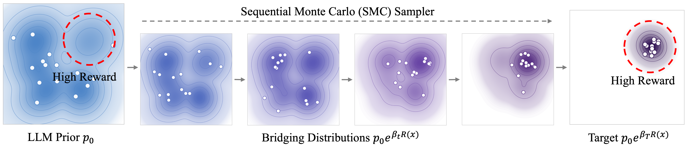
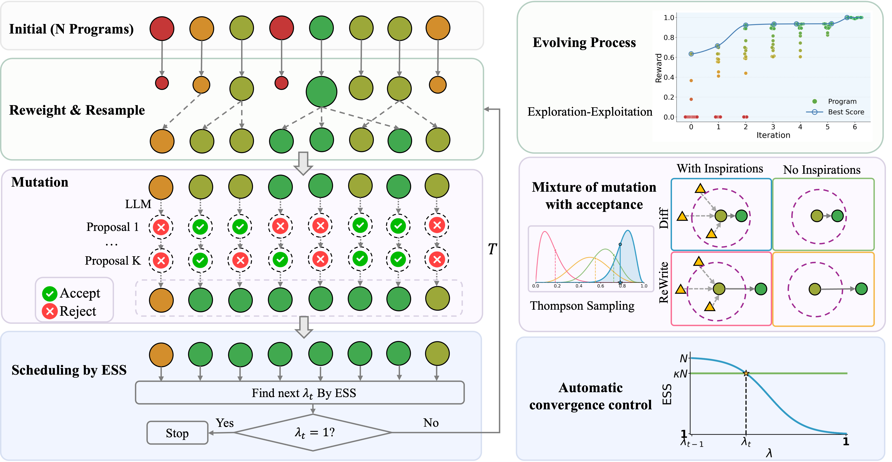

<h1 align="center">🧬 SMCEvolve: Principled Scientific Discovery via Sequential Monte Carlo Evolution</h1>

<p align="center">
  
</p>

LLM-driven program evolution has emerged as a powerful tool for automated
scientific discovery, yet existing frameworks offer no principled guide for
designing their individual components and provide no guarantee that the search
converges. We introduce **SMCEvolve**, which recasts program search as
sampling from a reward-tilted target distribution and approximates it with a
**Sequential Monte Carlo (SMC)** sampler. From this view, three core
mechanisms emerge as principled components:

- 🎯 **Adaptive parent resampling**
- 🔀 **Mixture of mutation with acceptance**
- 🛑 **Automatic convergence control**

We further provide a **finite-sample complexity analysis** that bounds the
LLM-call budget required to reach a target approximation error. Across math,
algorithm efficiency, symbolic regression, and end-to-end ML research
benchmarks, **SMCEvolve surpasses state-of-the-art evolving systems while
using fewer LLM calls under self-determined termination**.

<p align="center">
  
</p>

---

## 🗂️ Repository layout

```
SMCEvolve/
├── 📄 run.sh            # one-shot single-problem run (edit + ./run.sh)
├── 📊 viz.sh            # launch the visualization server
├── 🧪 experiments/      # sweep + ablation scripts and docs
│   ├── run_exp.sh       #   148-problem sweep dispatcher
│   ├── run_exp.md       #   full reproduction guide
│   ├── run_ablation.sh  #   circle-packing ablation runner
│   ├── ablation_plan.md
│   └── ablation_results.md
├── 🧠 smcevolve/        # core library: controller, islands, proposer, prompts
├── ⚙️  configs/          # Hydra configs (algo / llm / problem groups)
├── 🎯 problems/         # task definitions (initial program + evaluator + task.md)
├── 👁️  viz/              # Flask viz server + static frontend
├── 📚 docs/             # algorithmic notes (technical document)
└── 📦 outputs/          # run artifacts (gitignored)
```

---

## 🚀 Quick start

### 1. 📦 Install dependencies with `uv`

The project uses [uv](https://docs.astral.sh/uv/) for environment management.
Install uv once:

```bash
curl -LsSf https://astral.sh/uv/install.sh | sh
```

Sync the environment (creates `.venv/` from `pyproject.toml` + `uv.lock`) and
activate it:

```bash
uv sync
source .venv/bin/activate
```

All subsequent `python` / `pip` commands use the project venv.

### 2. 🔑 Configure API credentials

Copy the example env file and fill in your own key:

```bash
cp .env.example .env
# edit .env
```

`.env` holds:

```
OPENAI_API_KEY=sk-...
API_BASE_URL=https://openrouter.ai/api/v1 # or https://api.openai.com/v1 or any OpenAI-compatible endpoint
```

Any OpenAI-compatible endpoint works (OpenAI, Azure, LiteLLM, local vLLM,
Ollama, etc.). `.env` is gitignored — do not commit real keys.

### 3. ▶️ Run a single problem

With the venv active:

```bash
python -m smcevolve.main problem=circle_packing algo=medium
```

Override any Hydra config from the CLI. Examples:

```bash

# Bigger search: more islands × particles × proposals
python -m smcevolve.main problem=circle_packing \
    algo.n_islands=4 algo.particles_per_island=16 algo.n_proposals=4

# Cap LLM calls / tighten convergence (β = target inverse temperature, κ = ESS threshold)
python -m smcevolve.main problem=circle_packing \
    algo.max_iterations=20 algo.beta=30 algo.kappa=0.99

# Force a single kernel (skip Thompson Sampling)
python -m smcevolve.main problem=circle_packing \
    +algo.prompt.force_kernel=diff_with_inspo
```

Available presets:

| Group     | Options |
|-----------|---------|
| `problem` | `circle_packing`, `target_value`, `blackbox_optimization`, `autoresearch`, `math_*` (10 — kissing number, Heilbronn triangle, hexagon packing, autocorrelation inequalities, Erdős min overlap, …), `algotune_*` (8 — FFT convolution, LU factorization, eigenvectors, PSD cone projection, …), `symreg_*` (129 — bio population growth, chemical reactions, physical oscillators, …). See [`configs/problem/`](configs/problem/) for the full list of **148 registered problems**. |
| `algo`    | `medium` |
| `llm`     | `openai` |

See [`configs/`](configs/) for the full config tree.

---

## 🧪 Reproducing the paper experiments

All sweep and ablation tooling lives in [`experiments/`](experiments/). Run
every command from the **repo root** — the scripts internally `cd` to it.

### 🔭 Sweep (4 categories, 148 problems)

| Category       | # problems | Notes |
|----------------|-----------:|-------|
| `math`         |  10        | CPU; mixed NumPy/JAX |
| `algotune`     |   8        | CPU; wall-clock reward, **forced serial** |
| `symreg`       | 129        | CPU; BFGS fitting |
| `autoresearch` |   1        | GPU; ~25 min per candidate, exclusive 24 GB |

```bash
# overnight sweep over all 4 categories (small preset, ~4–8 h)
SWEEP_TAG=run1 ./experiments/run_exp.sh all

# one category
./experiments/run_exp.sh category math
./experiments/run_exp.sh category symreg

# one problem
./experiments/run_exp.sh single math_kissing_number

# multi-GPU autoresearch
AR_GPUS=0,1,2,3 ./experiments/run_exp.sh category autoresearch
```

Live progress: `tail -f outputs/_sweep/run1/_sweep.log`.
Full guide (env vars, output layout, cost estimates):
[`experiments/run_exp.md`](experiments/run_exp.md).

### 🔬 Ablation (circle packing, 9 runs)

Groups isolate the effect of **β/κ** (selection pressure), **population
architecture** (islands × particles × best-of-K), and **kernel choice**
(diff vs. rewrite, with/without inspiration):

```bash
./experiments/run_ablation.sh A1          # one experiment
./experiments/run_ablation.sh groupA      # one group
./experiments/run_ablation.sh all         # all 9 runs
SEED=123 ./experiments/run_ablation.sh A1 # change seed
```

Design and group layout: [`experiments/ablation_plan.md`](experiments/ablation_plan.md).
Recorded results: [`experiments/ablation_results.md`](experiments/ablation_results.md).

---

## 📂 Outputs

Every run writes to a timestamped (or tagged) directory:

```
outputs/<category>/<problem>/sweep_<TAG>/   # or outputs/<problem>/<YYYY-MM-DD_HH-MM-SS>/ for single runs
├── events.jsonl      # one JSON record per event (proposals, resamples, migrations, final)
├── main.log          # human-readable log
└── event_logs/
    ├── island_0/     # per-island event streams
    ├── island_1/
    └── _final.json   # best program + summary
```

The visualization server reads `events.jsonl` directly.

## 📊 Visualize

Launch the Flask-based viewer (venv active):

```bash
./viz.sh                    # http://127.0.0.1:5173
./viz.sh --port 8080
./viz.sh --host 0.0.0.0     # bind all interfaces
```

It lists every run under `outputs/` (newest first) and renders the event
stream — reward trajectories, particle populations, LLM cost, best program.

---

## ➕ Add your own problem

A problem is just three files in `problems/<your_problem>/`:

1. 📝 **`task.md`** — natural-language description shown to the LLM.
2. 🌱 **`initial_program.py`** — seed program that the evolver mutates.
3. ⚖️ **`evaluator.py`** — must define `evaluate(program: str) -> float`. Return
   a scalar reward (higher = better). Return `0.0` on any failure so malformed
   programs don't crash the run.

Then register it as a Hydra config at `configs/problem/<your_problem>.yaml`:

```yaml
name: your_problem
dir: problems/your_problem
initial_program: initial_program.py
evaluator: evaluator.py
task_file: task.md
timeout: 15.0        # seconds per candidate evaluation
```

Run it:

```bash
python -m smcevolve.main problem=your_problem algo=medium
```

### Minimal `evaluator.py` template

```python
def evaluate(program: str) -> float:
    namespace: dict = {"__name__": "__main__"}
    try:
        exec(program, namespace)
        result = namespace.get("result")
        return float(result) if result is not None else 0.0
    except Exception:
        return 0.0
```

See [`problems/circle_packing/evaluator.py`](problems/circle_packing/evaluator.py)
and [`problems/target_value/evaluator.py`](problems/target_value/evaluator.py)
for working examples.

---

## 📚 Docs

- 🧠 **Algorithm internals** — [`docs/SMCEvolve_Technical_Document.md`](docs/SMCEvolve_Technical_Document.md)
  (annealing schedule, ESS bisection, kernel mixing with Thompson Sampling,
  MAP-Elites inspiration selection, island migration).
- 🧪 **Experiment guide** — [`experiments/run_exp.md`](experiments/run_exp.md).
- 🔬 **Ablation plan** — [`experiments/ablation_plan.md`](experiments/ablation_plan.md).
